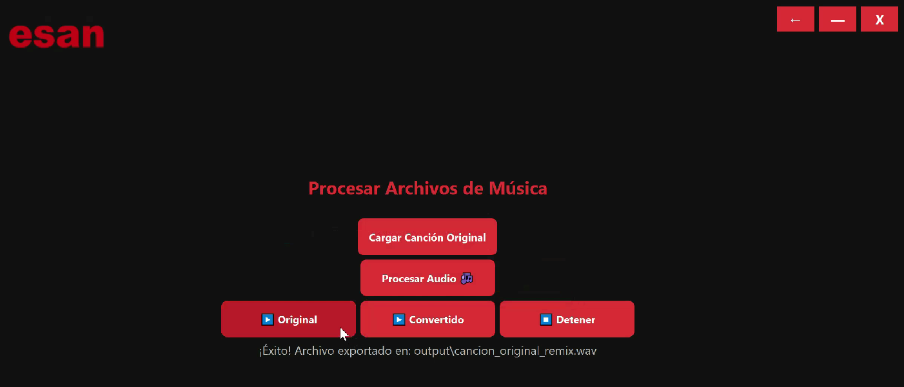
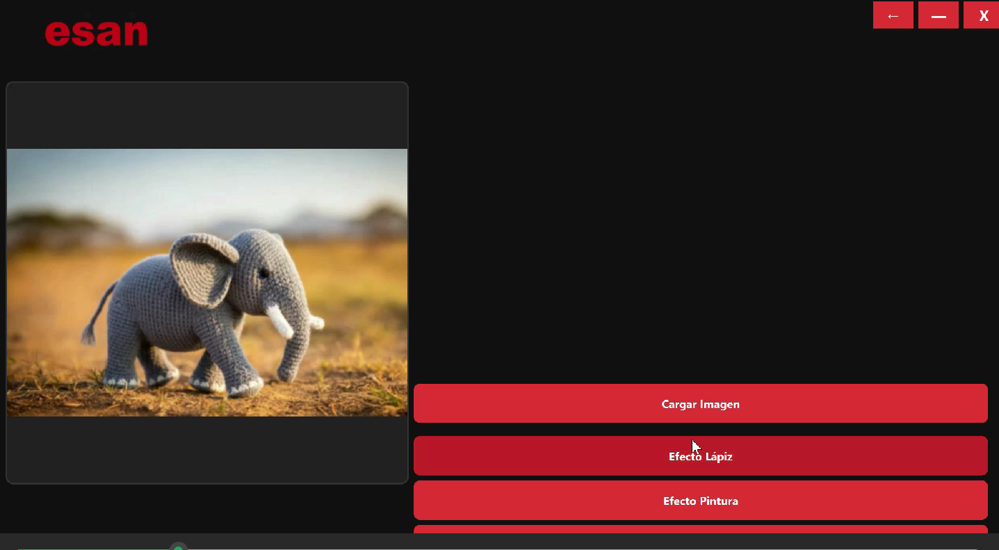

# 🎓 **PROYECTOS - CÍRCULO DE INVESTIGACIÓN ALAN TURING (CIAT) 2025**

Bienvenidos al repositorio de proyectos desarrollados por el equipo **CIAT**. Aquí se documentan 4 soluciones tecnológicas presentadas, destacando la innovación en automatización, inteligencia artificial e IoT.

**👥 JUNTA DIRECTIVA DEL CÍRCULO DE INVESTIGACIÓN ALAN TURING (CIAT):**
- Presidente: Gerson Chancas Evangelista
- Vicepresidente: Aaron Soto López
- Coordinador de Finanzas: Yoel Miranda
- Coordinador de Entrenamiento y Competencias: José Domingo Cabrera
- Coordinador de Relaciones Públicas y Marketing: Leslie Neciosup
- Coordinador de Investigación e Innovación: Luis Taype

-----

## 📋 **Índice**

1.  [Introducción]()
2.  [📂 Lista de Proyectos]()
3.  [📜 Licencia]()

-----

## 📝 **Introducción**

Este repositorio recopila **4 proyectos** estratégicos desarrollados por el equipo CIAT. Cada solución ha sido diseñada para resolver problemas complejos mediante arquitecturas de software avanzadas, desde la orquestación de IA en la nube hasta el hardware inteligente para la sostenibilidad.

-----

## 📂 **Lista de Proyectos**

### **📌 PROYECTO 1: Pipeline Automatizado de Covers con IA (RVC Orchestration)**
  - **📖 Descripción:** Solución de ingeniería de software que automatiza el proceso de clonación de voz y generación de "covers" musicales. Transforma una tarea manual y compleja de 30 minutos en un flujo de trabajo de un solo clic, integrando un entorno local (Windows) con computación en la nube de alto rendimiento (Google Colab). El sistema orquesta autónomamente la separación de pistas, la configuración de GPUs remotas y la mezcla final de audio.
    
  - **🎯 Objetivos:**
    - Automatización Total: Eliminar la intervención humana en las etapas de separación de audio (Demucs), inferencia de voz y mezcla, reduciendo el tiempo de operación drásticamente.
    - Arquitectura Híbrida Local-Nube: Superar las limitaciones de hardware local aprovechando GPUs Tesla T4 gratuitas en la nube, conectadas mediante un "puente" asíncrono (ntfy.sh) que salta la restricción de falta de SSH en Colab.
    - Interacción Autónoma: Implementar bots de navegación (Selenium/PyAutoGUI) que controlen la interfaz de la IA en la nube y gestionen la descarga de resultados validados.
      
  - **🛠️ Tecnologías utilizadas:**
      - Python: Lenguaje principal del cliente local y scripts de orquestación.
      - Google Colab (GPU Tesla T4): Entorno de ejecución para inferencia pesada (RVC/Applio).
      - Demucs (Meta AI): Modelo de separación de fuentes de audio.
      - Selenium & PyAutoGUI: Automatización de navegador y simulación de periféricos.
      - ntfy.sh (Pub/Sub): Protocolo de comunicación asíncrona entre Local y Nube.
      - FFmpeg / Pydub: Procesamiento y mezcla de audio digital.
        
  - **🔗 Enlace al repositorio o demo:**
      - Repositorio: https://github.com/AaronSSL/Proyecto-Cover.git
        
  - **🖼️ Imagen representativa:**

-----

### **📌 PROYECTO 2: ClasiFIRE - Depósito Inteligente (Residuos 4.0)**
  - **📖 Descripción:** Prototipo de "Depósito Inteligente" diseñado para combatir la gestión ineficiente de residuos sólidos urbanos. ClasiFIRE automatiza la segregación de materiales reciclables en la fuente utilizando Inteligencia Artificial y una arquitectura distribuida. A diferencia de los sistemas tradicionales, este proyecto implementa el paradigma "Residuos 4.0", dotando de visión por computadora y conectividad IoT al punto de recolección para eliminar errores humanos y riesgos sanitarios.
    
  - **🎯 Objetivos:**
    - Segregación en Tiempo Real: Automatizar la clasificación de residuos mediante Redes Neuronales Convolucionales (CNN), mejorando la tasa de reciclaje efectiva (actualmente solo 33% global).
    - Arquitectura Distribuida: Implementar un sistema de procesamiento modular donde se delegan tareas: inferencia pesada (Visión) en SBCs, conectividad en microcontroladores Wi-Fi y control de motores en chips AVR.
    - Seguridad y Eficiencia: Reducir la exposición de trabajadores a patógenos y optimizar los costos operativos de la clasificación manual.
      
  - **🛠️ Tecnologías utilizadas:**
      - Deep Learning (CNN): Modelos de visión computacional para reconocimiento de objetos.
      - IoT (Internet of Things): Interconexión de dispositivos para gestión de datos.
      - SBC (Single Board Computer): Procesamiento de inferencia neuronal.
      - Microcontroladores (AVR & ESP/Wi-Fi): Control de hardware y comunicación asíncrona.
      - Edge Computing: Procesamiento de datos en el borde para baja latencia.
   
  - **🔗 Enlace al repositorio o demo:**
      - Repositorio: https://github.com/Davfre3/Codigos-de-robotica.git
        
  - **🖼️ Imagen representativa:**

-  https://github.com/user-attachments/assets/a1b155a1-fd40-4d3c-9b56-2cd6e63bb593

-----

### **📌 PROYECTO 3 y 4: AndeanFlow (Transformación de Huayno a Reggaetón) y DavinciESAN**
📖 **Descripción AndeanFlow**: Herramienta de ingeniería de sonido automatizada diseñada para realizar una fusión cultural musical, transformando canciones del género Huayno en pistas de Reggaetón. El sistema procesa archivos de video o audio originales, utiliza algoritmos de Inteligencia Artificial para separar las vocales de la instrumentación folclórica y, mediante scripts de Python, realiza una mezcla programática con bases rítmicas urbanas (loops).

📖 **Descripción DavinciESAN**: Procesamiento gráfico diseñado para potenciar aplicaciones de edición de imágenes de escritorio. Su función principal es la aplicación automatizada de filtros artísticos avanzados (estilo boceto, pintura al óleo y cómic) utilizando algoritmos de visión artificial de alto rendimiento (OpenCV). Adicionalmente, sirve como puente de interoperabilidad técnica, gestionando la conversión eficiente de datos y la optimización de resoluciones para garantizar una visualización fluida dentro de interfaces gráficas modernas basadas en PyQt6.

🎯 **Objetivos AndeanFlow**:
- Separación de Fuentes con IA: Implementar el modelo Demucs (Meta AI) para aislar limpiamente la voz del cantante, eliminando instrumentos complejos como arpas o violines del audio original.
- Orquestación de Audio: Desarrollar un pipeline en Python que automatice la carga de beats de reggaetón y la superposición de las voces extraídas, ajustando tiempos y volúmenes sin intervención manual.
- Generación de Remixes: Crear un flujo de trabajo capaz de producir una fusión musical ("Andean Flow") exportando el resultado final en formatos listos para reproducción (.wav/.mp3).

🎯 **Objetivos DavinciESAN**:
- Implementación de Algoritmos: Programar funciones de transformación de imagen utilizando la librería OpenCV para generar efectos estilizados (dibujo a lápiz, pintura al óleo y cómic) mediante técnicas de filtrado gaussiano, preservación de bordes y umbralización adaptativa.
- Interoperabilidad Técnica: Establecer un puente de conversión de datos eficiente entre las matrices numéricas de OpenCV y los objetos gráficos de PyQt6 (QImage/QPixmap), permitiendo la visualización en tiempo real de las imágenes procesadas.
- Optimización de Recursos: Desarrollar mecanismos de redimensionamiento inteligente que ajusten la resolución de las imágenes manteniendo su relación de aspecto, asegurando así un rendimiento fluido y una carga computacional equilibrada en la interfaz de usuario.

🛠️ **Tecnologías utilizadas:**

- Python: Lógica principal de orquestación (main.py, musica.py).
- Demucs: Modelo de Deep Learning para la separación de stems (Voz/Instrumental).
- Pydub / FFmpeg: Librerías para el procesamiento, corte y mezcla de señales de audio.
- Gestión de Archivos: Automatización de carpetas de entrada (input) y salida (output).

🔗 **Enlace al repositorio o demo:**

Repositorio: https://github.com/AaronSSL/Proyecto-huyano---regueaton.git

🖼️ **Imagen representativa:**
 - 
 - 

## 📜 **Licencia**

Este repositorio contiene los trabajos intelectuales del equipo CIAT y está protegido bajo la licencia **[CIAT_2025]**. Consulta el archivo LICENSE para más detalles.
